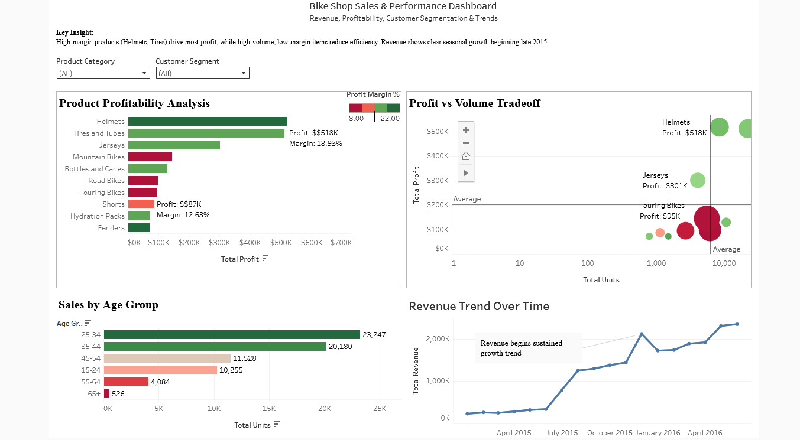

# Bike Shop Sales & Profitability Dashboard

## Overview
This project presents an interactive Tableau dashboard analyzing product-level profitability, sales volume tradeoffs, customer demographics, and revenue trends.

The goal was to identify high-margin products, evaluate efficiency across categories, and provide actionable insights for business decision-making.

## Key Insights
- High-margin products (Helmets, Tires) generate the majority of total profit
- High-volume, low-margin items reduce overall efficiency
- Customers aged 25–44 represent the largest purchasing segment
- Revenue shows a clear upward trend beginning mid-2015

## Dashboard Preview

## Dashboard Features
- Interactive filters for product category and customer segment
- Profit vs Volume tradeoff analysis using scatter plot
- Product profitability ranking with margin-based color encoding
- Customer segmentation by age group
- Revenue trend visualization with annotated insights

## Tools Used
- Tableau Public
- SQL (data preparation)
- Excel (data cleaning)

## Live Dashboard
[View Tableau Dashboard](https://public.tableau.com/views/BikeShopSalesProfitabilityDashboard/BikeShopSalesPerformanceDashboard)

## Files
- `bike_shop_analysis.twbx` – Tableau packaged workbook
- `dashboard.png` – Dashboard preview

## Author
Nathan Chambers
